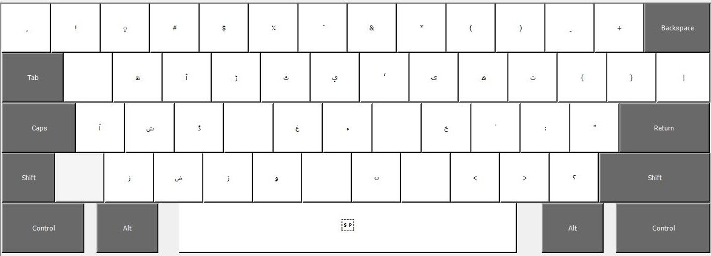

# Panun Kaeshur Keyboard
A Kashmiri keyboard for English typists. 
### Installation
Clone the repository and run the setup file in `./build` directory. 
### Layout
#### Main
The main layout looks like this. 

#### Shifted Layout
When <kbd>Shift</kbd> is held down, the layout switch to this. 

