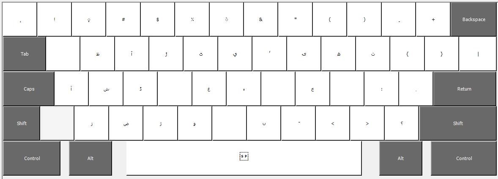
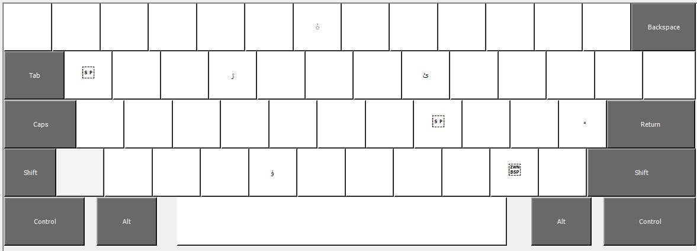

# Panun Kaeshur Keyboard
A Kashmiri keyboard for English typists.
### Installation
Clone the repository or simply extract the [ZIP](https://github.com/erstan/panun/archive/refs/heads/e_t.zip), and run the setup file located in the `./build` directory. 
### Layout
#### Main
The main layout looks like this : 

#### Shifted Layout
When <kbd>Shift</kbd> is held down, the layout switches to this : 

#### AltGr Layout
When <kbd>AltGr</kbd> is held down, the layout switches to this : 

#### Supported characters
##### Letters
> ا ب پ ت ٹ ث ج چ ح خ د ڈ ذ ر ڑ ز ژ س ش ص ض ط ظ ع غ ف ق ک گ ل م ن ں و ۅ ہ ھ ء ی ۍ ؠ ے 
##### Special Letters (AltGr+Key)
> ۆ  ێ  ۯ 
##### Diacritics
The diacritics have been used with `ا`, the first letter of the Kashmiri alphabet. 
> آ اَ اِ أ إ اُ اٗ اٟ ٲ اّ 

### Key mappings
##### Letters 
| Name of the letter | IPA | Kashmiri glyph | English Key |
| ---- | --- | -------------- | ----------- |
|ALEF| /aː, ʔ/, ∅|ا |<kbd>a</kbd> | 
|BEH|/b/ |ب | <kbd>b</kbd> |
|PEH|/p/|پ | <kbd>p</kbd> |
|TEH|/t̪/|ت | <kbd>t</kbd> |
|TTEH|/ʈ/|ٹ | <kbd>Shift</kbd>+<kbd>t</kbd> |
|SEH|/s/|ث | <kbd>Shift</kbd>+<kbd>p</kbd> | 
|JEEM|/d͡ʒ/|ج | <kbd>j</kbd> | 
|TCHEEM|/t͡ʃ/|چ | <kbd>c</kbd> | 
|HAH|/h, ɦ/|ح | <kbd>h</kbd> | 
|KHAH|/kʰ/|خ | <kbd>Shift</kbd>+<kbd>k</kbd> | 
|DAL|/d̪/|د | <kbd>d</kbd> |
|DDAL|/ɖ/|ڈ | <kbd>Shift</kbd><kbd>d</kbd> | 
|ZAL|/z/|ذ | <kbd>z</kbd> | 
|REH|/r/|ر | <kbd>r</kbd> | 
|DEH|/ɽ/|ڑ | <kbd>Shift</kbd>+<kbd>r</kbd> | 
|ZEH|/z/|ز | <kbd>Shift</kbd>+<kbd>z</kbd> | 
|TCXAY|/t͡s/|ژ | <kbd>Shift</kbd>+<kbd>c</kbd> | 
|SEEN|/s/|س | <kbd>s</kbd> | 
|SHEEN|/ʃ/|ش | <kbd>Shift</kbd>+<kbd>s</kbd> | 
|SAUD|/s/|ص | <kbd>x</kbd>  | 
|ZAUD|/z/|ض | <kbd>Shift</kbd>+<kbd>x</kbd>  | 
|TAH|/t̪/|ط | <kbd>w</kbd>  | 
|ZAH|/z/|ظ  | <kbd>Shift</kbd>+<kbd>w</kbd> | 
|AIN|/aː, oː, eː, ʔ/, ∅|ع |<kbd>e</kbd> | 
|GHAIN|/g/|غ | <kbd>Shift</kbd>+<kbd>g</kbd> | 
|FEH|/f, pʰ/|ف | <kbd>f</kbd>  | 
|QAF|/k/|ق | <kbd>q</kbd>  | 
|KEEF|/k/|ک | <kbd>k</kbd>  | 
|GAF|/ɡ/|گ | <kbd>g</kbd>  | 
|LAM|/l/|ل | <kbd>l</kbd>  | 
|MEEM|/m/|م | <kbd>m</kbd>  | 
|NOON|/n, ̃/|ن | <kbd>n</kbd>  | 
| | | ں | <kbd>Shift</kbd>+<kbd>n</kbd>  | 
| WAV |/w, uː, oː, ɔː/|و | <kbd>v</kbd> | 
|OA| | ۅ | <kbd>Shift</kbd>+<kbd>v</kbd>| 
| HEH| | ہ | <kbd>o</kbd>| 
|DOACHASHMEE|/h, ɦ/ or /ʰ, ʱ/|ھ | <kbd>Shift</kbd>+<kbd>o</kbd>  | 
|HAMZA|/ʔ/, ∅|ء | <kbd>Shift</kbd>+<kbd>h</kbd>  | 
|FARSI YEH|/j, iː, aː/ | ی | <kbd>i</kbd> | 
|KASHMIRI YEH| | ؠ | <kbd>Shift</kbd>+<kbd>y</kbd>  | 
|YEH|/ɛː, eː/|ے | <kbd>y</kbd> | 

##### Diacritics
| Diacritic Name | Kashmiri glyph | English Key |
| ---- | -------------- | ----------- |
|FATHA| َ|<kbd>-</kbd>  | 
|KASRA| ِ | <kbd>_</kbd>  | 
|DAMMA| ُ| <kbd>u</kbd> | 
|INVERTED DAMMA| ٗ|<kbd>Shift</kbd>+<kbd>u</kbd> |
|HAMZA SUPERSCRIPT| ٔ | <kbd>`</kbd> | 
|HAMZA SUBSCRIPT| ٕ| <kbd>~</kbd> | 
|WAVY HAMZA SUBSCRIPT| ٟ| <kbd>@</kbd> | 
| INVERTED 'v' MARK |  ٛ | <kbd>^</kbd> | 
| LITTLE 'v' MARK |  ٚ | <kbd>AltGr</kbd>+<kbd>v</kbd> |
|FATHATAN| ٍ |  <kbd>'</kbd> | 
|KASRATAN|  ً| <kbd>AltGr</kbd>+<kbd>'</kbd>| 

##### Special letters
| Letter Name | IPA | Kashmiri glyph | English Key |
| ----------- | --- | -------------- | ----------- | 
| | | ٲ | <kbd>Shift</kbd>+<kbd>e</kbd> | 
| | | ۯ | <kbd>AltGr</kbd>+<kbd>r</kbd> |
| | | ێ | <kbd>AltGr</kbd>+<kbd>i</kbd> | 
| | | ۆ | <kbd>AltGr</kbd>+<kbd>v</kbd> | 
